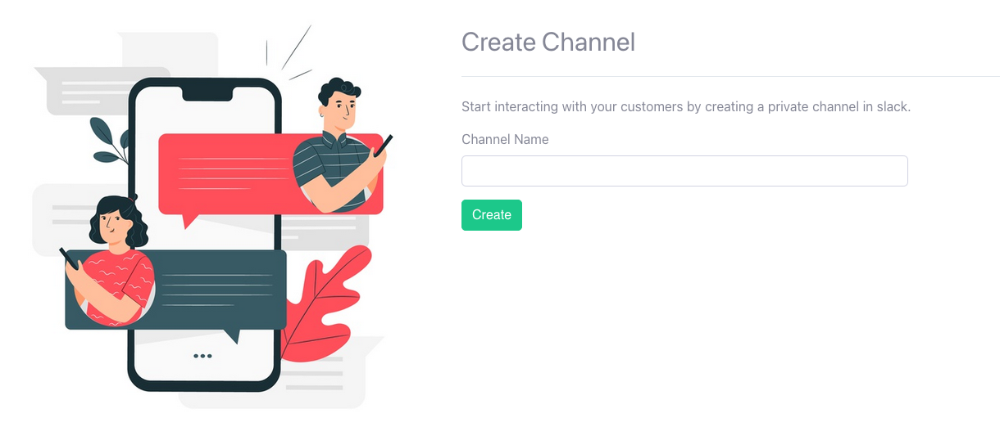
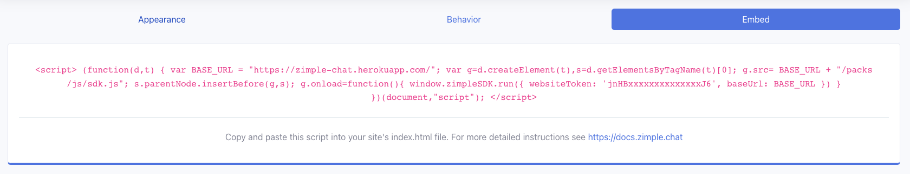

# Installation
{: .fs-9 }

## Add to Slack
{: .mb-lg-4 }

Zimplechat is a slackbot that posts the messages on the widget by a visitor to the designated slack channel. For this to work first we need to add zimple chat to your Slack team. It will ask you to add the app to your slack team with few permission that are necessary for the app to work.
{: .mb-lg-4 }

## Creating slack channel
{: .mb-lg-4 }

After adding the zimple slackbot to your slack team, you are directed to your teams dashboard where your are asked to create a private slack channel to which all  the user messages are directed. Channel's name must be lowercase, without spaces or periods, and can’t be longer than 80 characters.
{: .mb-lg-4 }

## Embedding widget script
{: .mb-lg-4 }

Voila! Now you are ready chat with you customer after this final step. On the dashboard click on the `Embed` tab and copy the script code and paste it anywhere inside the body tag of your website.
{: .mb-lg-4 }

